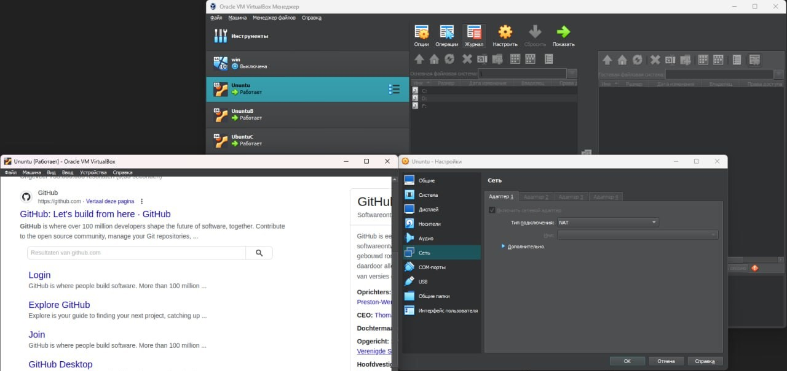
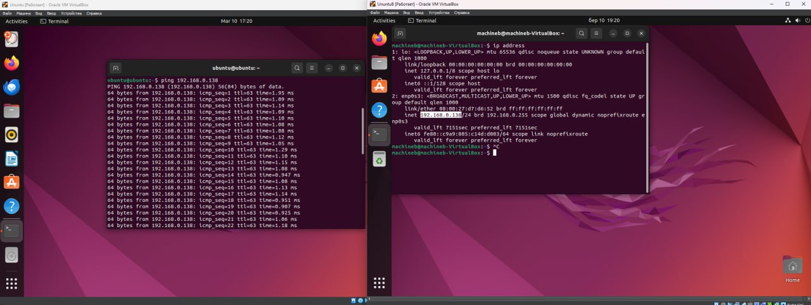
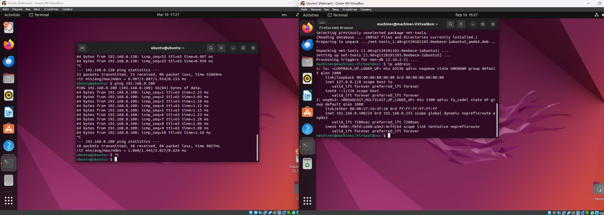
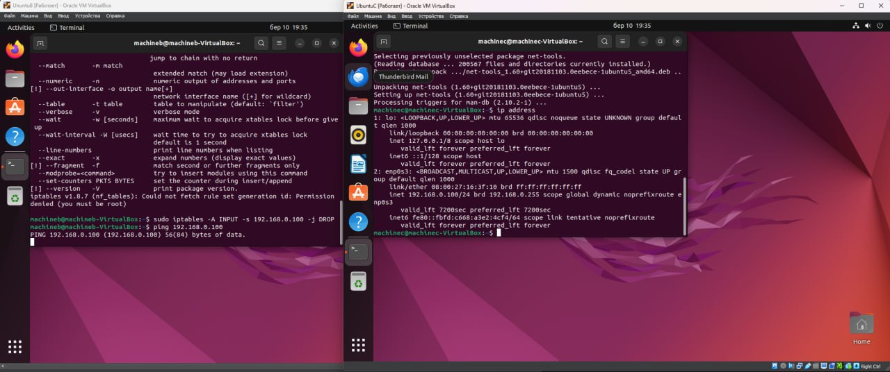
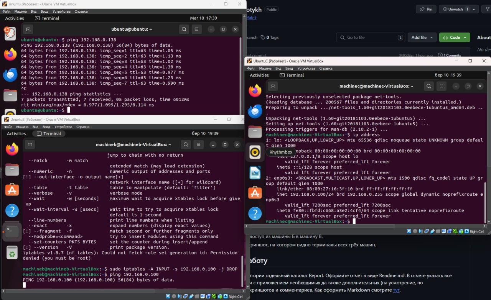

# Отчёт по лабораторной работе №3

В данной лабораторной работе необходимо было, используя Virtual Box, создать три виртуальные машины А, Б и В и настроить их следующим образом:

1. Организовать сетевой доступ из машины А в машину Б.
2. Организовать сетевой доступ из машины А в машину В,
3. но запретить доступ из машины Б в машину В.
4. Приложить скриншот, на котором видно терминалы всех трёх машин.

Обозначения:

- Виртуальная машина А(далее А) -- Ubuntu(имя ubuntu)
- Виртуальная машина А(далее Б) -- Ubuntu(имя machineb)
- Виртуальная машина А(далее В) -- Ubuntu(имя machinec)

На первом этапе необходимо было создать А и обеспечить доступ в интернет(Рисунок 1)

Рисунок 1

Далее была создана Б с настройкой сети "Сетевой мост", таким образом она была соединена с А
Проверка наличия соединения была представлена на рисунке 2:

Рисунок 2

Аналогично была создана и настроена В(Рисунок 3):

Рисунок 3

Чтобы запретить доступ из Б в В исользовалась команда `sudo iptables -A INPUT -s 192.168.0.100 -j DROP`, где 192.168.0.100 - IP адрес В. На скриншоте продемонстрирован таймаут при ожидании отклика от В Б(Рисунок 4):

Рисунок 4

Ниже приведён скриншот всех трёх машин(Рисунок 5)

Рисунок 5